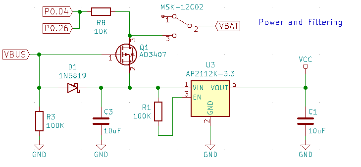

## LEDs
#### Single LED:

With no resistor, the LED would burn out quickly.

Calculating the resistor value: $R = \frac{V_{source}-V_{LED}}{I_{LED}}$.

[Read more](https://www.electronicshub.org/simple-led-circuits/)

### RGB LED strips
Either you have a strip of LEDs that are all connected up. i.e. 3 different ground circuits and one common voltage or you have addressable LEDs.

#### Addressable LEDs
Each LED has a tiny microcontroller allowing each one to light up with a unique color and brightness.
Three lines: positive voltage, ground, and data.
Each LED reads the data and passes it onto the next one.

[Read more](http://www.thesmarthomehookup.com/beginners-guide-to-individually-addressable-rgb-led-strips/)

## Joysticks
- 4 / 5 lines
- 5 if we are using it as a button as well
- VCC, GND, X, Y
- X, Y need to go to analog pins.

[Read more](https://www.brainy-bits.com/arduino-joystick-tutorial/)

## Rotary encoders
The encoder generates two offset square wave outputs. Measuring both of them can tell us the direction and speed we are rotating.

Encoders rotate around continuously but potentiometers only rotate one revolution.

**Important:** 
Two 10k pull up resistors might be needed to stop the two direction pins from floating. 
I needed it. This isn't shown on many wiring diagrams.

[Read more](https://www.electroschematics.com/rotary-encoder-arduino/)

When wiring in a keyboard circuit, treat it like a normal switch but have two extra pins:

[Using multiple encoders in a keyboard:](https://www.youtube.com/watch?v=DyHxccSvsPs) The two pins on every encoder for the two square wave outputs (A and B) are wired to the same two pins on the controller. 
So we only need to use two pins on the controller for any number of encoders. 
The C lines are wired through a diode to the rows. A matrix scan can then measure the values for each individual encoder.

## Display ILI9341 with touchscreen
https://www.youtube.com/watch?time_continue=33&v=beyDkTBhpgs&feature=emb_title

# Microcontrollers

## USB input
- GND and connector go to GND
- Data lines have a 22 ohm resistor in series
- USBVCC goes to separate circuit

## Power switching and regularisation
For the nrfMicro:

- USBVCC is connected to the gate of a P-MOSFET. This prevents current flowing from the battery from pins 3 to 2 of the MOSFET when the USB is plugged in. 
- There is a pull up resistor, R1, connected to pin 3 of the linear regulator. Is this needed to stop large currents flowing into EN? Pin 3 needs to be high for the regulator to work.
- Two [decoupling capacitors](https://www.youtube.com/watch?v=BpuCv4hfYZU) are used to filter noise from the input (USB or battery). 
- The Schottky diode D1 provides reverse polarity protection.
- Why is R3 there?
- P0.04 and P0.26 are connected to the output of the battery with a series resistor. Why is this resistor here?

## LiPo Charging
In the nrfMicro:

- This is what is provided in the datasheet for the MCP73831.
- The capacitor present in the datasheet is found in the power filtering circuit

## Power switching with external ground
I think some power hungry components like LEDs can be turned off by toggling pin 1.09. 
This makes there be no voltage difference between VCC and EXT_GND. 

