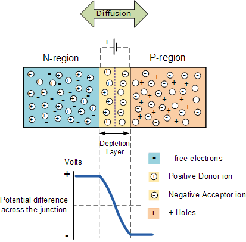
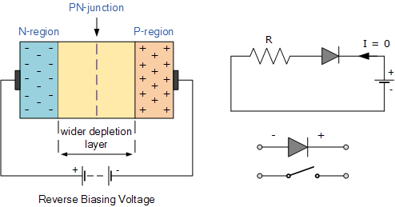
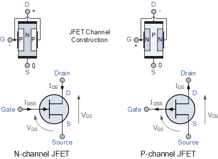

## Good resources
- https://www.tutorialspoint.com/basic_electronics/basic_electronics_materials.htm: Useful theory at the start.
- Sparkfun tutorials
- [KiCad STM32 Hardware Design and JLCPCB Assembly](https://www.youtube.com/watch?v=t5phi3nT8OU)
- [KiCad STM32 + RF + USB Hardware Design](https://www.youtube.com/watch?v=14_jh3nLSsU)
- [similar to this collection](https://github.com/benblazak/ergodox-firmware/blob/master/references.md)
- [Contextual Electronics](https://www.youtube.com/channel/UCkJRycUz2CylxpiP-zMePow)

## Power circuit

nrfMicro: 
- It uses a schotky diode for reverse polarity protection.
- It has a pull down resistor, so that when the usb is not connected, it doesn't float.
- When a high voltage from the USB is applied to the P-channel mosfet, it cuts current from flowing from the battery.

https://www.falstad.com/circuit/e-pmosfet.html

## Regulator
Linear regulator is used to maintain a steady voltage. Can also drop the voltage.
Low 

## Pull up resistor
A pin that is not connected to anything might be any where between 0 and 1; known as floating.

When the pin is connected to ground, there will be connection between ground and VCC. 
Using a large resistor (>10kΩ) stops the circuit shorting. 

https://learn.sparkfun.com/tutorials/pull-up-resistors/all 

## Electrons
*Valence electrons* in the outermost shell, loosely attached to the nucleus.
Atoms brought close to one another will result in their valence electrons pairing; forms a *covalent bond*.

Thermal energy supplied to the crystal results in some electrons breaking their covalent bonds. The electrons wander leaving a *hole*.
The hole can be considered a unit of positive charge.
When a potential is applied, electrons move towards the positive part. But the holes "move" towards the negative part. Electrons fill the holes closer to the positive part. Called *hole current*.

## Semiconductors
- Resistivity is less than insulators, greater than conductors.
- Resistance increases with temperature decrease.

*Intrinsic* semiconductors have low conduction capacity. We add impurities (doping) to turn them into *extrinsic* semiconductors.

There are N-type and P-type extrinsic semiconductors.
### N-type semiconductors
Say arsenic is added to germanium. There are **free electrons present**. So when conduction takes place, electrons are majority carriers and holes are minority carriers.
The material is electrically neutral because the free electrons come with protons (in the arsenic).
When an electric field is applied to an N-type semiconductor, the free electrons travel towards the positive electrode. This is called negative or N-type conductivity.
Remember: N-type for negative things flowing.

### P-type semiconductors
Say boron is added to germanium. This results in **holes being present**. The holes are called acceptors (of electrons). Again the semiconductor material is electrically neutrol.
When an electric field is applied, holes travel to the negative electrode (at a slower pace than electrons): known as P-type conductivity.
Remember: P-type for positive things flowing.

### PN-junctions
An N-type and a P-type semiconductor are brought together.
This forms a PN junction. Electrons from the N-type flow across the junction to combine with the holes of the P-type. This creates positive ions in the N-type and negative ions in the P-type. This region is called the depletion region and the process is called diffusion. The remaining electrons in the N-type are repelled by this layer of negative ions, preventing any further flow. 
The barrier is called the depletion zone as it has no charge carriers.

## Diodes
Allows flow of electricity in only one direction.

### Workings
Forward biased: A field applied to the diode, such that the P-type material end has the positive charge and the N-type material end has the negative charge. If the field is greater than the value of the potential barrier (approx 0.7 volts for silicon), current will start to flow. This is due to the negative electrode pushing electrons across the junction.

Reverse biased: When the diode is connected in the other way, electrons will try and flow from the N-type material through towards the positive electrode. This increases the width of the barrier which acts like an insulator stopping the flow of current. 

https://www.electronics-tutorials.ws/diode/diode_3.html

Read more: https://www.tutorialspoint.com/basic_electronics/basic_electronics_diodes.htm

## Transistors

Two common types: BJTs and MOSFETs.
Generally BJTs are used for smaller currents: <1 Amp.

### BJTs
We join three semiconductors creating a sandwich PNP or NPN. This creates two PN-junctions that share a common P or N terminal. The transistor's ability to switch between insulator and conductor enables it to have two basic functions: switching or amplification. 

The principle of operation of the two transistor types PNP and NPN, is exactly the same the only difference being in their biasing and the polarity of the power supply for each type.

3 terminals: Emitter, base collector.
When a voltage is applied to the base, some current will flow from the base to the emitter. This induces a much larger current to flow from the collector to the emitter when this happens.

BJTs are all about current. The base is connected to the emitter.

## FETs
FETs are all about voltage. Takes very little current to turn on. Pins are gate, drain, and source. The gate is not directly connected to the other pins. The gate pin is used to control the FET (i.e. control the potential difference across the drain and source). The input resistance of the FET can be considered almost infinite. No current flows into the gate.

FETs can be considered as a voltage controlled resistor: the current flowing through the main channel between the Drain and Source is proportional to the input voltage.

MFETs can be made smaller than BJTs, have lower power consumption and can mostly be used equivalently.

Can work in enhanchement and depletion mode and come in N-channel and P-Channel. There are no PN-junctions in the main current carrying path between the Drain and Source terminals. This path is called the *channel*. FETs are called unipolar. BJTs are called bipolar because they operate with both types of charge carriers, holes and electrons. But because the main channel in FETs are of just one type, they just use one charge carrier. 

The input impedance (resistance) is very high for SFETs unlike for BJTs. The high impedance makes them very sensitive to input voltage signals.

FETs come as Junction Field Effect Transistors (JFET) or Metal Oxide FETs (MOSFETs).

## JFETs

N-Channel JFET's have a greater channel conductivity (lower resistance) since electrons have a higher mobility through a conductor than holes do. This makes N-Channel JFET's a more efficient conductor compared to the P-Channel JFETs.

The gate terminal is of the opposite type of material than the drain and source terminals. This creates a PN-junction with the channel. 
Note that *through* the channel there are no junctions, but there is one on its side.

The voltage V_{DS} causes a current I_D (= I_{DS}) to flow from drain to source. Current can be conducted equally well in either direction. The channel is narrow. So if we cause the channel to narrow (by increasing the depletion region of the NP-junction), the impendance of the channel will increase, thus decreasing I_D.

https://www.youtube.com/watch?v=_DZ7baOhNFQ

The magnitude of the current flowing through the channel between the Drain and the Source terminals is controlled by a voltage applied to the Gate terminal, which is reverse-biased. In an N-channel JFET this Gate voltage is negative while for a P-channel JFET the Gate voltage is positive.

In an N-channel JFET, if the gate voltage is 0, the PN-junction is very narrow. If the gate voltage is negative, holes move away from the barrier, and electrons in the N-type move away from the barrier. This increases the barrier width, reducing the channel's conductivity.

## MOSFETS
Is a more advanced FET. The gate is insulated from the channel.

Depletion mode: current can flow between Drain and Source when no voltage is applied. A negative voltage stops the flow.

Enhancement mode:
N-Channel enhancement MOSFETs are the most common transistor used.

When we apply a voltage between gate and source, current is allowed to flow from the drain to the source.
A low voltage will only allow little current to flow, there is a high resistance.
Opposite for high voltage.
There is a threshold voltage where most of the resistance change occurs.
The current through the gate to source doesn't matter.

The resistance between the drain and source is called R_{DS} ON.

nrfMicro uses an AO3407 P-Channel MOSFET to stop the battery being used when the board is plugged in.

https://www.youtube.com/watch?v=o4_NeqlJgOs

### Application of MOSFETs

#### Using as a switch:
https://www.youtube.com/watch?v=8DMZSxS-xVc

## Capacitors
- Can store energy in the form potential difference between two plates.
- Plates become positive and negative.
- Resists a sudden change in voltage.

Consider a potential difference on a capacitor. 
For the plate connected to the negative electrode, electrons will accumulate on that plate. 
For the plate connected to the positive electrode, positive charge will accumulate on that plate. 
If we provide a connection between the two plates, the plates will discharge quickly.

### Using capacitors for smoothing
Variations in the input power supply can be smoothed using capacitors.
A capacitor is connected between VCC and GND. The capacitor charges up. If the supply drops, the capacitor will discharge, making up for the drop. It will discharge because there isn't enough potential to keep all these electrons closely together. The only way for the electrons to go is through the load / circuit.

Read more: https://www.electronics-notes.com/articles/analogue_circuits/power-supply-electronics/capacitor-smoothing-circuits.php 

## Full controller notes
Overview of the Xenon:
https://docs.particle.io/assets/images/xenon/xenon-block-diagram.png

Basic parts to the controller:
- main module: nRF52840
- battery charging module
- power selection logic and regulator
- on board LEDs and buttons

Why are there 22 Ohm resistors on the usb data lines:
https://www.eevblog.com/forum/projects/why-usb-data-series-resistors/
These do not appear in the nrfMicro.

## Thingies
### Line Decoder
Can increase the number of outputs.
Say it has three inputs and eight outputs. The 8 possible combinations of inputs determine which of the 8 outputs is changed.

## Reverse polarity protection
### Diode
- Simple
- Wasted power
### Schotky diode
- Can leak current in the wrong direction
### P-Channel MOSFET

